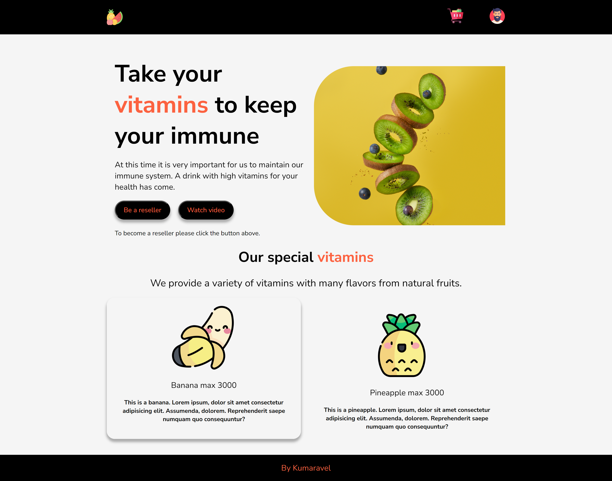
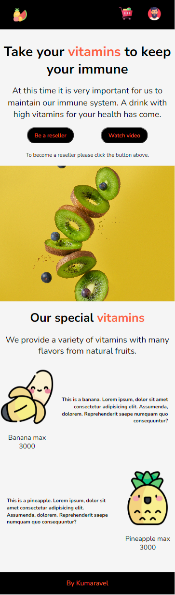

# Personal Fruits Project

Welcome to my personal fruits project! This is a delightful landing page dedicated to the wonderful world of fruits. As someone who has an immense passion for fruits, I embarked on a spontaneous journey to create and design this mobile-responsive landing page.

## Features

- Navigation segment
- Description segment
- Card segment

## Project Structure

The project is structured as follows:

todo-app/

- `styles/`: Directory containing CSS and SCSS files for styling.
  - `style.css`: Compiled CSS file.
  - `style.scss`: SCSS source file.
  - `style.css.map`: Source map for SCSS to CSS mapping.
  - `global.scss` : Golbal settings for app
  - All other style files are for the respective components in my application
- `index.html`: The main HTML file that contains the structure of the fruits webpage.

## Getting Started

1. Clone this repository: `git clone <repository-url>`
2. Open the `index.html` file in a web browser.
3. Start adding, editing, and managing your tasks!

## Application Technologies

- HTML5
- SCSS

## Screenshots

## Links

Project URL:

## Contributing

Contributions are welcome! If you find any issues or have ideas for improvements, feel free to submit a pull request.
